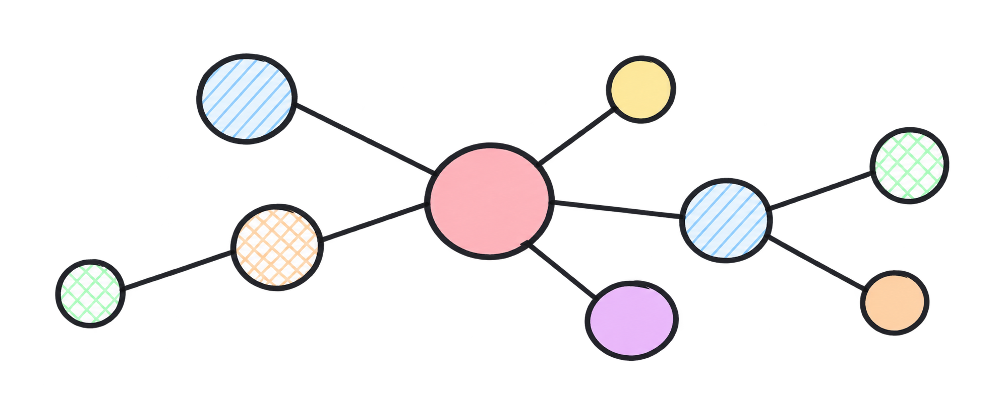

# terra-package

<p align="center">
  
</p>

<p align="center"><strong>Python tools for reproducible international trade analysis: networks, time series and CES-based shock simulations.</strong></p>
<p align="center">Part of the TERRA analytical framework developed at Istat.</p>

<p align="center">
  
  <a href="https://www.cambridge.org/core/journals/world-trade-review/article/exploring-the-complexity-of-international-trade-networks-with-terra/58E2D97F1A1A4179E52C602F9450C4FE"></a>
  <a href="https://doi.org/10.1017/S1474745626101591"></a>
</p>

<p align="center">
  <a href="https://www.cambridge.org/core/journals/world-trade-review/article/exploring-the-complexity-of-international-trade-networks-with-terra/58E2D97F1A1A4179E52C602F9450C4FE"><strong>Research article</strong></a>
  · <a href="notebook/example_notebook.ipynb"><strong>Example notebook</strong></a>
  · <a href="docs/terra_package_internal_workflow_map.md"><strong>Workflow map</strong></a>
  · <a href="docs/api_classifications.md"><strong>API classifications</strong></a>
</p>

## Overview

`terra-package` is a Python library for reproducible analysis of international
trade data. It supports trade-network metrics, aggregated time-series analysis,
basket analysis and CES-based supplier-removal scenarios.

The package is part of the broader TERRA (*imporT ExpoRt netwoRk Analysis*)
framework developed at Istat and can work with both user-provided data and data
retrieved through TERRA APIs.

## What You Can Do with `terra-package`

| Capability | Description |
|---|---|
| **Network analysis** | Build trade networks or analyze precomputed network metrics. |
| **Time-series analysis** | Analyze moving averages, STL trends and optional structural breaks. |
| **Basket analysis** | Aggregate a selected quantity or value measure over time. |
| **Shock simulation** | Explore CES-based supplier-removal and redistribution scenarios. |

## Choose Your Data Type

API and CSV are loading routes. A TERRA file saved locally and reloaded later
should be treated according to its data type.

| Your data | Load with | Analyze with |
|---|---|---|
| Trade microdata | `TerraDataset` | `analyze_network()`, `analyze_basket()`, `simulate_shock()` |
| Precomputed network metrics | `NetworkMetricsDataset` | `analyze_network()` |
| Aggregated time series | `TimeSeriesDataset` | `analyze_series()` |

## Usage Examples

The examples below use TERRA API workflows to highlight the package's
API-first usage. Local CSV loading is also supported. API examples require
access to the TERRA API.

### `analyze_network()`

Accepts `TerraDataset` or `NetworkMetricsDataset`. With `TerraDataset`, it
builds a trade network and computes node metrics. With `NetworkMetricsDataset`,
it uses precomputed metrics directly. When `base_period` is provided, it also
computes fixed-base indices.

The individual metric indices keep the usual fixed-base formula
`metric_raw_t / metric_raw_base * 100`. The `synthetic_index` is computed by
first averaging the raw Out Degree, Betweenness and Distinctiveness values,
then converting that raw average into a fixed-base index.

Network metrics are usually interpreted using trade value as the edge weight.
Quantity-based weights can also be used when the objective is to analyze
physical flows.

```python
from terra_package import NetworkMetricsDataset, analyze_network

base_payload = {
    "percentage": "50",
    "transport": [0, 1, 2, 3, 4, 5, 7, 8, 9],
    "product": "TOT",
    "flow": 0,
    "weight": True,
    "position": None,
    "edges": None,
    "collapse": True,
}

metrics_ds = NetworkMetricsDataset.from_api(
    dataset="Intra",
    base_payload=base_payload,
    start_date="2025-05",
    end_date="2025-05",
    frequency="month",
)

metrics = analyze_network(metrics_ds, base_period="202505")
print(metrics.head())
```

### `analyze_basket()`

Requires `TerraDataset`. It aggregates one selected trade measure over time.
The selected measure can be quantity (`qty`) or value (`value`), depending on
the available columns and the analytical objective.

```python
from terra_package import TerraDataset, analyze_basket

trade_ds = TerraDataset.from_api_microdata(
    product_class="cpa",
    period="202505",
    country="IT",
    partner="ES",
    product="00",
    flow=1,
    criterion=1,
)

basket = analyze_basket(
    trade_ds,
    country="IT",
    partner="ES",
    product="00",
    direction="E",
    measure="value",
)
print(basket)
```

### `analyze_series()`

Uses `TimeSeriesDataset` for aggregated time series. The backward-compatible
`TerraDataset` path is also supported for trade microdata aggregation. The
function computes moving averages, STL trends and an optional break model.

```python
from terra_package import TimeSeriesDataset, analyze_series

base_payload = {
    "flow": 1,
    "var": "00",
    "partner": "AC",
    "dataType": 2,
    "tipovar": 1,
    "varType": 1,
}

ts_ds = TimeSeriesDataset.from_api(
    base_payload=base_payload,
    countries=["IT"],
)

out = analyze_series(ts_ds, flow=1, break_date="2025-03")
print(out["data"].head())
print(out["results"]["series"])
analyze_series(
    ts_ds, flow=1, break_date="2025-03", plot=True
)["figure"].show()
```

### `simulate_shock()`

Requires `TerraDataset` with quantity and value data. It runs on one selected
period and simulates removal of one supplier using CES redistribution.

```python
import pandas as pd

from terra_package import TerraDataset, load_trade_microdata_from_api, simulate_shock

trade_df = load_trade_microdata_from_api(
    product_class="nstr",
    period="202505",
    country="IT",
    partner=None,
    product="011",
    flow=1,
    criterion=0,
    transport=[1],
)
trade_df = (
    trade_df.groupby(["source", "target", "period", "product", "flow"], as_index=False)
    .agg({"qty": "sum", "value": "sum"})
)
trade_df = trade_df[(trade_df["qty"] > 0) & (trade_df["value"] > 0)].copy()

trade_ds = TerraDataset.from_dataframe(
    trade_df,
    trade_to_network=True,
    mode="import",
    imp_exp=["1", "2"],
    two_values=True,
)

simulated = simulate_shock(
    trade_ds,
    country_from="CA",
    country_to="IT",
    period="202505",
    product="011",
    sigma=2,
)

simulated.simulation
```

## Installation

```bash
git clone https://github.com/istat-methodology/terra-package
cd terra-package
python -m venv .venv
source .venv/bin/activate  # On Windows: .venv\Scripts\activate
pip install -e .
```

**Requirements:** Python ≥ 3.8, pandas ≥ 1.0, networkx ≥ 2.0,
distinctiveness ≥ 0.1.5, statsmodels, matplotlib and requests.

## Analysis Reference

| Function | Accepted data | Main result |
|---|---|---|
| `analyze_network()` | `TerraDataset`, `NetworkMetricsDataset` | Node-level network metrics and optional fixed-base indices |
| `analyze_basket()` | `TerraDataset` | Aggregated trade measure |
| `analyze_series()` | `TimeSeriesDataset` | Moving averages, STL trends and an optional break model |
| `simulate_shock()` | `TerraDataset` | CES supplier-removal redistribution scenario |

## TERRA API

`terra-package` can retrieve trade microdata, precomputed network metrics,
aggregated time series and reference classifications from the TERRA API. API
and local files are alternative loading routes; analytical compatibility
depends on the data type.

## Citation

If you use TERRA in your research, please cite:

> Bruno, M., Brogi, F., Cerasti, E., De Fausti, F., Fronzetti Colladon, A.,
> Guardabascio, B., & Massacci, G. (2026). Exploring the Complexity of
> International Trade Networks with TERRA. *World Trade Review*, 1–24.
> doi:[10.1017/S1474745626101591](https://doi.org/10.1017/S1474745626101591)

## Contributors

- Federico Brogi
- Mauro Bruno
- Giulio Massacci
